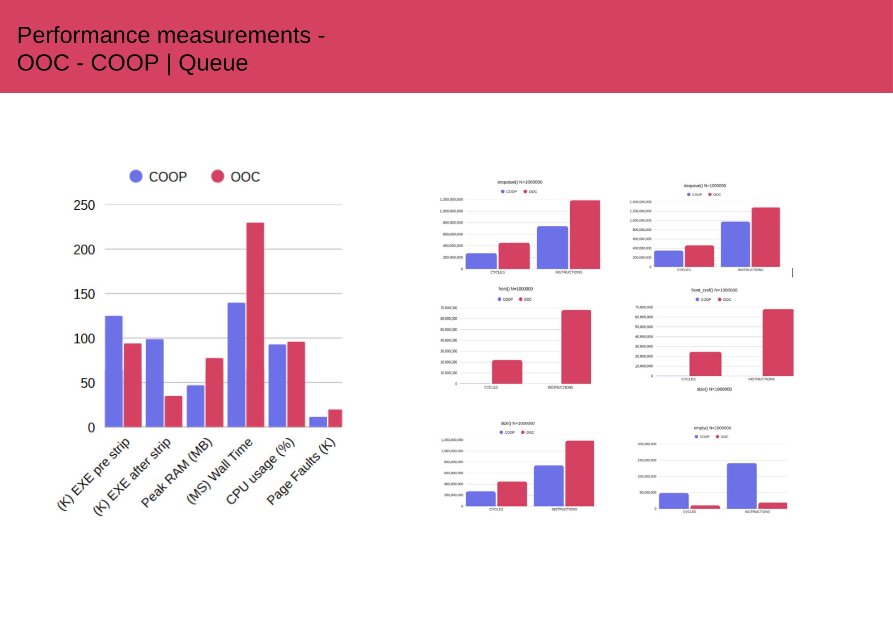
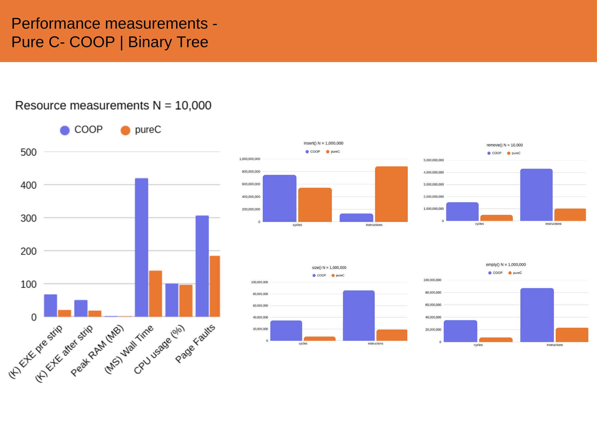
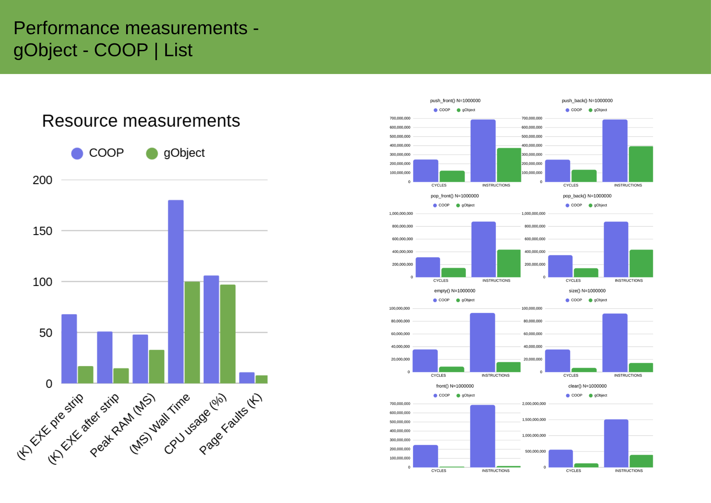

**COOP** stands for **C** **O**bject **O**riented **P**rogramming framework, developed by FineALGs (now part of [Extra.Tech](https://extra.tech/)) with real time embedded systems in mind, 
along with our students from the Codalleh program (now part of [KamaTech](https://www.kamatech.org.il/))

COOP implements object-oriented programming in standard C through a macro-based layer. It provides **classes**, **inheritance** (with virtual functions), **exception with automatic destructor unwinding**, **memory management**, our own **unit-testing framework**, and data-structure implementations designed to remain compatible to static analysis tools and comply with MISRA guidelines—while preserving type safety and IntelliSense support in mainstream IDEs.

It was tested on Windows (Visual Studio/MSBuild) and Linux (GCC). COOP aims to supply expressive, safe abstractions with minimal runtime overhead so you can adopt it by simply copying the `COOP` folder into your project and:

```cpp
#include "COOP.h"
```

You will find a usage cheat sheet in `The COOP Cheat Sheet.docx`, and the `UnitTestC` suite showcases idiomatic patterns.
## Object-Oriented Principles in COOP
- **Class construction macros** (`DEF_CLASS`, `END_DEF`, `FUNCTIONS`) generate a strongly typed struct together with constructor and destructor declarations and the associated method tables.

- **Inheritance and polymorphism** rely on `DEF_DERIVED_CLASS`, `DERIVED_FUNCTIONS`, and `FUN_OVERRIDE`, which expand into virtual table definitions and override-safe call-sites.This mechanism allows code written against a base type to dispatch dynamically to derived implementations, substitutability across the hierarchy.

- **Deterministic lifetime management** uses constructor/destructor macros (`INIT_CLASS`, `END_FUNCTIONS`) and shared-ownership helpers (`SharedObjPtr`, `SharedPodPtr`) to express ownership semantics that mirror RAII.

- **Exception-safe semantics** are provided via COOP's `TRY`/`CATCH`/`FINALLY` macros. When an exception path is taken, the framework walks registered destructors, ensuring resources owned by the current scope are released.
      
>### IMPORTANT: `MEM_SIZE_T` (Macro) Configuration
>
> ### Configuration Options
>
> * **`MEM_SIZE=ushort`** (Default): Use `unsigned short`. Ideal for 16-bit systems or where memory is highly constrained (max index 65,535).
> * **`MEM_SIZE=int`**: Use `int`. Required for 32-bit systems or when working with large data structures that may exceed 65,535 elements.
>
> ---
>
> ### **Action Required: Project Configuration**
>
> You must define the `MEM_SIZE` variable in your CMake configuration.
>
> **For Visual Studio Users (Recommended):**
> Add the `variables` array to your `CMakeSettings.json` configuration.
>
> ```json  
>       // CHANGE THIS VARIABLE BLOCK
>       "variables": [
>         {
>           "name": "MEM_SIZE",
>           "value": "ushort", // or "int"
>           "type": "STRING"
>         }
>       ]
> ```
>
> **For Command-Line CMake (Linux/WSL):**
> Pass the definition as a `-D` parameter during configuration:
>
> ```bash
> # Example: Build using the 'int' type
> cmake -DCMAKE_BUILD_TYPE=Release -DMEM_SIZE=int ..
> ```
>
> The CMake output log will confirm your selection during the build configuration:
>
> `COOP: MEM_SIZE_T is set to 'int' (MEM_SIZE='int')`

## Data Structures
- **List (`GenericList`)**: a doubly linked list with configurable element size, type tags for diagnostics, and iterator support. expose strongly typed push/pop/front/back methods while retaining the underlying generic buffer.

- **Queue (`GenericQueue`)**: thin compositional layer over `GenericList`, offering FIFO semantics, iterator access and typed enqueue/dequeue helpers for primitive values and object smart pointers.

- **Binary Tree (`GenericBinaryTree`)**: pointer-based tree with configurable element type, pre/in/post-order traversals, node-removal support, and an in-order iterator with bidirectional navigation.

- **Vector (`GenericVector`)**: contiguous dynamic array with manual capacity control, typed `at`/`get`/`set` accessors, iterator integration.

- **Tensor (`GenericTensor`)**: multi-dimensional façade built atop vectors and integer shape descriptors; supports coordinate-based indexing, reshape operations, and zeroing for multidimensional numeric workloads.

The COOP framework provides several object-oriented data structures built with performance, type safety, and real-time embedded systems in mind.

| Data Structure | Generic Class | API Functions | Supported Types |
| :--- | :--- | :--- | :--- |
| **List** (Doubly Linked List) | `GenericList` | `push_back`, `push_front`, `pop_back`, `pop_front`, `front`, `back`, `size`, `empty`, `clear`, `print`, `begin`, `end` | `int`, `float`, `char`, `objSPtr` |
| **Queue** (FIFO) | `GenericQueue` | `enqueue`, `dequeue`, `front`, `front_cref`, `clear`, `size`, `empty`, `print`, `begin`, `end` | `int`, `char`, `float`, `objSPtr` |
| **Binary Tree** | `GenericBinaryTree` | `insert`, `remove`, `get_size`, `is_empty`, `print` (Pre/In/Post), `traverse_in`,`traverse_pre`,`traverse_post`, `begin`, `end` | `int`, `float`, `char`, `objSPtr` |
| **Vector** (Dynamic Array) | `GenericVector` | `push_back`, `pop_back`, `at`, `get`, `set`, `resize`, `size`, `zero_all`, `dataPtr`, `print`, `begin`, `end` | `int`,`uint8_t`, `char`, `float`, `objSPtr` |
| **Tensor** (Multi-Dimensional Array) | `GenericTensor` | `at`, `get`, `set`, `reshape`, `zero_all` | `int`, `char`, `float`, `object` |


## Iterator Support

COOP data structures enable generic sequential access through the `Iterator` base class. To support this mechanism, a container must implement the crucial methods: **`begin()`** and **`end()`**.

The idiomatic and safest way to iterate over elements is using  **`ITER_FOR`** macro. This macro abstracts away the manual handling of the iterator's lifecycle and traversal logic (relying on the iterator's `next()`, `equals()`, and `get_cref()` calls).

**Example Usage with `ITER_FOR`:**

```c
int sum = 0;
ITER_FOR(int, val, (GenericVector*)&vec)
{
    sum += val;
} END_ITER_FOR
```

Each structure ships with dedicated unit tests under `UnitTestC`, demonstrating construction, mutation, traversal, and iterator behavior.

## Performance Summary

Performance was benchmarked against comparable C libraries (Pure C, OOC, GObject) to measure the overhead and efficiency of COOP's object-oriented abstractions.

---

### Queue (vs. OOC)



When benchmarked against other C-OOP frameworks, the COOP `Queue` demonstrates significant advantages in both speed and memory efficiency.

* **Superior Speed:** In a high-volume (N=1,000,000) `enqueue` test, COOP is **1.78x faster** (0.103s) than the OOC implementation (0.183s).
* **Excellent Memory Efficiency:** COOP achieves this speed while being far more memory-conscious, consuming **~39% less Peak RAM** (47.2MB) compared to OOC (77.6MB).

---

### Binary Tree (vs. Pure C)



This benchmark highlights the quality of COOP's generated code. While a Pure C implementation serves as a raw speed baseline, COOP's abstractions achieve a more efficient use of the CPU's execution units.

* **Higher CPU Efficiency (IPC):** COOP's `insert` operation achieves a significantly higher **IPC (Instructions Per Cycle) of 2.45**, compared to 1.63 for the Pure C version.



 The benchmarking methodology, hardware notes, and reproduction steps are documented in [`Compare/README.md`](Compare/README.md). Raw datasets and additional comparisons live in `Compare/`.

## Safety and Compliance

**COOP MISRA Compliance Summary**

* Static analysis performed with MISRA C:2012 rulesets on the COOP core and data structures.
* All diagnostics resolved or formally justified; macro-driven patterns that trigger false positives are documented in `MISRA_Compliance.txt`.
* Shared pointer utilities, iterators, and container APIs were exercised through the `UnitTestC` harness prior to certification.
* Compliance artefacts (reports, suppressions, tool configurations) are available upon request for safety-critical deployments.


## Computer Vision Extensions
- The `OpenCV` directory packages a COOP-based image-processing toolkit that mirrors key OpenCV primitives (grayscale buffers, Sobel, Gaussian, thresholding, non-maximum suppression). A dedicated guide with module walkthroughs and integration notes is available in [`OpenCV/README.md`](OpenCV/README.md).
- Unit tests under `OpenCV/UnitTest` exercise GrayImage pipelines end to end, providing ready-to-run validation on sample BMP assets.

---

COOP aims to give lightweight syntax and minimal performance overhead for achieving efficient and **safe** embedded code. Have fun!
